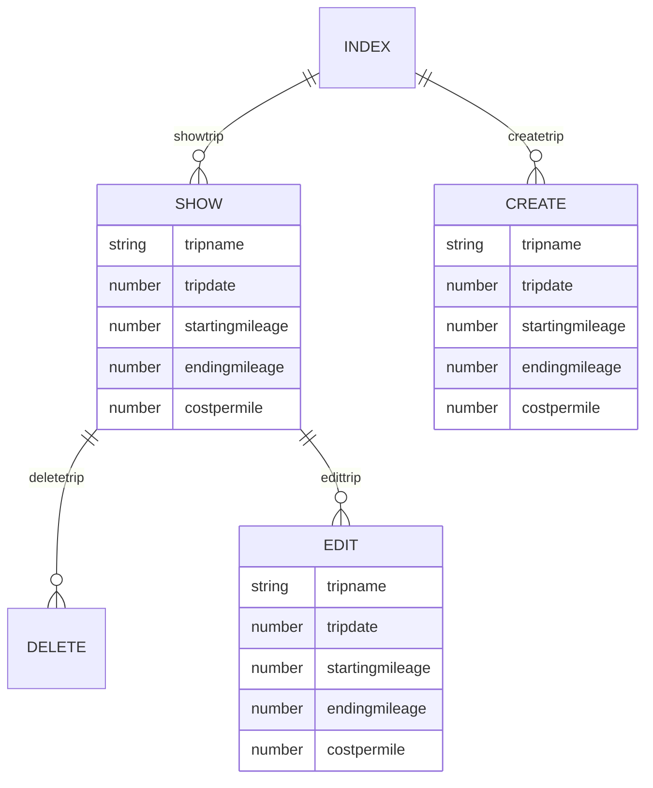

# Capstone Project Backend

- **Project Name:** Mileage Tracker
- **Project By:** Adrian Garcia
- [**Link To  Frontend GITHUB**]
- [**LINK TO DEPLOYED WEBSITE**]()
- **List of technologies used** Python, Javascript
- [**Link to Trello**]()

## Description

Mileage Tracker is an app that helps drivers keep track of their oen mileage. This will help drivers who get mileage reimbursements from their job. Mileage Tracker will make it easier for drivers to keep track of their own miles while making sure they are getting reimbursed the correct amount each pay period. 

## List of Backend Endpoints

|     ENDPOINT      | Method |          Purpose          |
| ----------------- | ------ | ------------------------- |
| /trips            | GET    | Display list of all trips driven  |
| /trip/new       | POST   | Create a new trip       |
| /trip/:id       | DELETE | Delete an existing trip  |
| /trip/:id       | PUT    | Update an existing trip  |
| /trip/:id       | GET    | Display one trip          |

## ERD (ENTITY RELATIONSHIP DIAGRAM)

